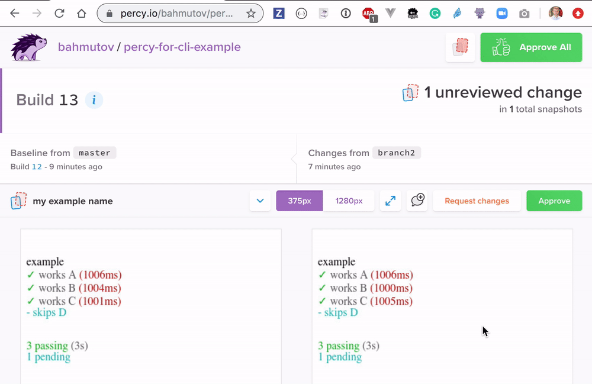

# percy-for-cli-example [](https://percy.io/bahmutov/percy-for-cli-example)

Confirms the output of CLI programs that use ANSI colors using [Percy.io](https://percy.io) online visual diffing service.

Read the blog post [Visual diffing flow for your pretty CLI applications](https://glebbahmutov.com/blog/visual-diffing-for-CLI-apps/)

**Note:** to push data to Percy requires API token. If we load the token using [as-a](https://github.com/bahmutov/as-a) then one can run the demo and send terminal output to Percy with commands

```shell
$ npm i
$ as-a percy-for-cli-example npm run demo-percy
```

Changes pushed to `master` branch are auto-approved on Percy. Pushing to other branches, if there are visual changes detected, requires manual review and approval. For example, changes in test duration were detected in this example.



## How it works

See [index.js](index.js). The terminal output from the child process is piped through [ansi-to-html](https://github.com/rburns/ansi-to-html) which converts ANSI escape characters to HTML styles. The final string output from a Mocha spec run looks something like this:

```html
<!DOCTYPE html>
<html>
  <head>
    <meta charset="utf-8" />
  </head>
  <body>
    <br /><br />
    example<br />
    <span style="color:#0A0"> ✓</span><span style="color:#555"> works A</span
    ><span style="color:#A00"> (1002ms)</span><br />
    <span style="color:#0A0"> ✓</span><span style="color:#555"> works B</span
    ><span style="color:#A00"> (1005ms)</span><br />
    <span style="color:#0A0"> ✓</span><span style="color:#555"> works C</span
    ><span style="color:#A00"> (1002ms)</span><br />
    <span style="color:#0AA"> - skips D</span><br /><br /><br /><span
      style="color:#5F5"
    >
    </span
    ><span style="color:#0A0"> 3 passing</span
    ><span style="color:#555"> (3s)</span><br /><span style="color:#0AA"> </span
    ><span style="color:#0AA"> 1 pending</span><br /><br />
  </body>
</html>
```

Then this "DOM" snapshot is sent to Percy agent process, which forwards it to Percy API where the images are recreated using a farm of real browsers. The images are compared to the "gold" images stored on Percy, and if there are differences detected, Percy web UI complains, breaks the build, fails GitHub status check, etc.

```js
// post HTML to the Percy agent
// follow "cy.request" code in
// https://github.com/percy/percy-cypress/blob/master/lib/index.ts
// and https://github.com/percy/percy-agent
const url = 'http://localhost:5338/percy/snapshot'
axios
  .post(url, {
    name: 'my example name',
    url: 'http://localhost/example',
    enableJavaScript: false,
    domSnapshot: html,
  })
  .catch(e => {
    console.error(e)
    throw e
  })
```
